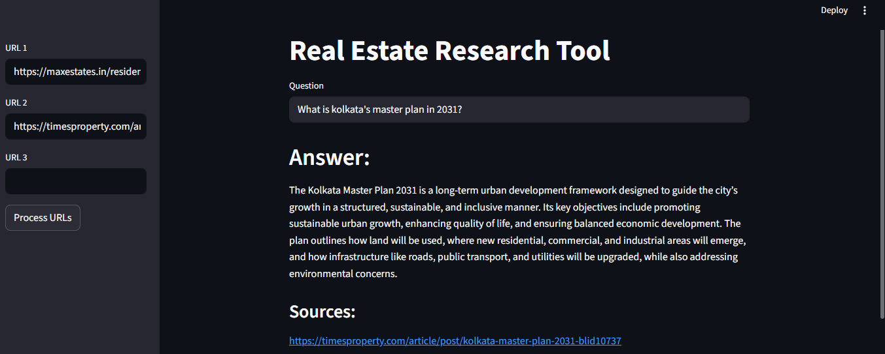

 
# 🏙️ **Real Estate Research Tool**

A user-friendly AI-powered research assistant designed to extract insights from real-estate news articles.  
Users can simply input URLs of real estate news, and the tool fetches, processes, and answers questions based on the content using advanced retrieval and LLM technology.  
*(Its features can easily be extended to any other domain.)*




---

## 🚀 **Features**

- 🔗 **Load multiple URLs** to automatically fetch article content.
- 🧠 **Process text** using LangChain’s `UnstructuredURLLoader`.
- 🔍 **Generate embeddings** using **HuggingFace’s `all-MiniLM-L6-v2`** model.
- 🗂️ **Store and retrieve data** with **ChromaDB** for fast, context-aware responses.
- 🤖 **Query real-estate insights** using **Llama 3** via **Groq API** for high-quality answers.
- 📚 Displays **source URLs** along with every generated answer for transparency.

---

## ⚙️ **Set-Up**

1. **Install Dependencies**

   Open your terminal and run:
   ```bash
   pip install -r requirements.txt
````

2. **Create Environment Variables**

   Inside the project directory, create a `.env` file and add your Groq API credentials:

   ```text
   GROQ_MODEL=llama-3.3-70b-versatile
   GROQ_API_KEY=your_groq_api_key_here
   ```

3. **Run the Streamlit App**

   Launch the web app with:

   ```bash
   streamlit run main.py
   ```

---

## 🧭 **Usage Guide**

Once the app starts, your browser will open automatically.

1. 📰 Enter up to 3 article URLs in the **sidebar**.
2. ⚡ Click **"Process URLs"** to fetch, split, and embed article content.
3. 🧩 The system:

   * Loads data via LangChain’s `UnstructuredURLLoader`
   * Splits text into chunks with `RecursiveCharacterTextSplitter`
   * Creates embeddings using HuggingFace
   * Stores them in ChromaDB
4. 💬 Type your **question** (e.g., *"How much energy do IGBC-certified green buildings save?"*).
5. 🤖 Get concise, LLM-generated answers **with source links** for reference.

---

## 🧪 **Example URLs**

For demonstration purposes, you can try:

* [Kolkata Master Plan 2031](https://timesproperty.com/article/post/kolkata-master-plan-2031-blid10737)
* [Max Estates Gurgaon Project](https://maxestates.in/residential-projects-in-gurgaon-meets-conscious-luxury)

---

## 📦 **Tech Stack**

| Component                  | Description                                                      |
| -------------------------- | ---------------------------------------------------------------- |
| **LangChain**              | Framework for building RAG (Retrieval-Augmented Generation) apps |
| **Groq API**               | Access to Llama 3 LLM for query answering                        |
| **ChromaDB**               | Vector database for document retrieval                           |
| **HuggingFace Embeddings** | Converts text into numerical vectors                             |
| **Streamlit**              | UI framework for interactive web apps                            |

---

## 🧑‍💻 **Project Structure**

```
Real-estate-tool/
├── main.py                 # Streamlit frontend
├── rag.py                  # Backend RAG pipeline logic
├── resources/
│   ├── image.png           # App screenshot
│   └── vectorstore/        # Stored ChromaDB embeddings
├── requirements.txt        # Dependencies
└── .env                    # API credentials
```

---

## 🪪 **License & Terms**

This software is licensed under the **MIT License**.
However, **commercial use is strictly prohibited** without prior written permission from the author.
Attribution must be provided in all copies or substantial portions of the software.

---

⭐ *Built with LangChain, HuggingFace, ChromaDB, and Streamlit — empowering real-estate insights through AI.*

```

```
